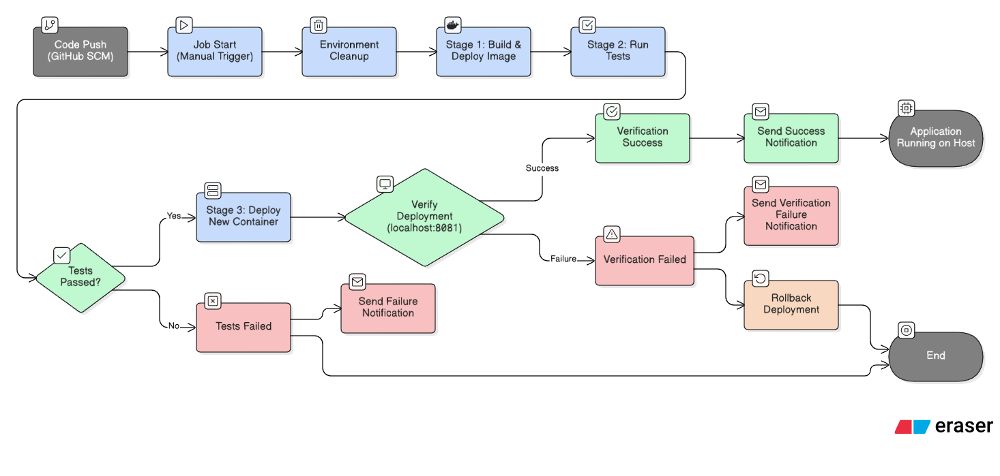
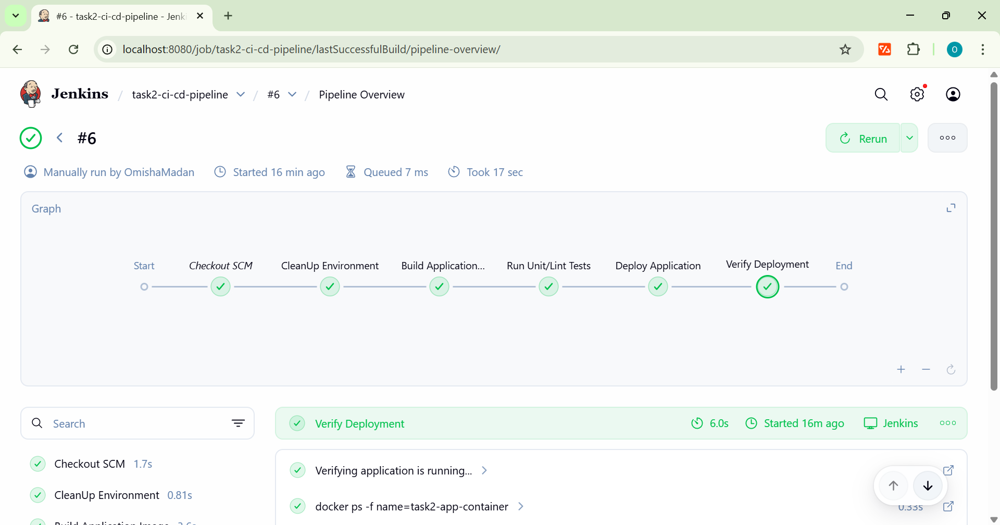
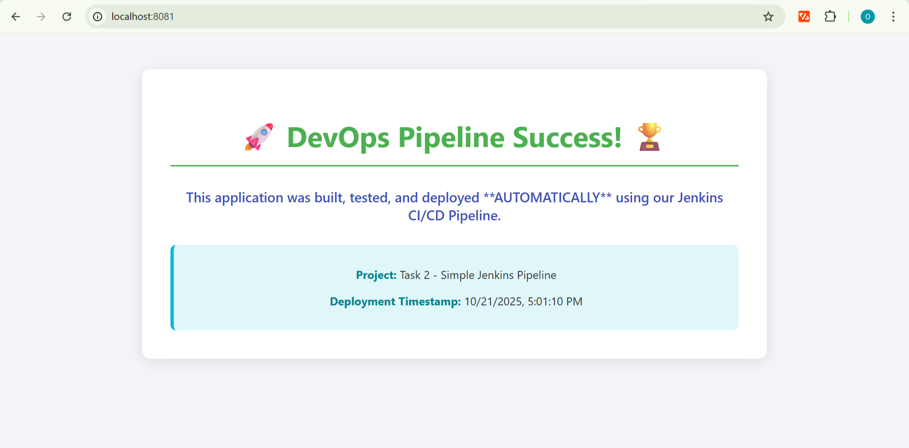

## DevOps Internship Task 2: Simple Jenkins CI/CD Pipeline

## 🎯 Objective
The primary goal of this task was to set up a basic Jenkins pipeline to automate the process of building, testing, and deploying an application. The pipeline was designed to practice fundamental **Continuous Integration (CI)** and **Continuous Deployment (CD)** principles.

## 🛠️ Tools and Technologies Used
| Tool | Purpose |
| :--- | :--- |
| **Jenkins** | Automation server for orchestrating the CI/CD pipeline |
| **Docker** | Used to containerize both the Jenkins server itself and the application being deployed |
| **GitHub** | Source Code Management (SCM)
| **Declarative Pipeline** | Modern, structured syntax used for the `Jenkinsfile`. |

## ⚙️ Architecture and Workflow

The following steps outline the automated workflow implemented in this repository:

1.  **Code Commit:** Developer pushes code changes to the `main` branch on this GitHub repository.
2.  **Jenkins Checkout:** Jenkins automatically pulls the latest code, including the `Jenkinsfile` and the application code.
3.  **Pipeline Execution:** The pipeline executes the defined stages:

    * **Stage: Build:** Builds the application's Docker image and tags it with the Jenkins Build Number for traceability.
    * **Stage: Test:** Executes a simulated test to ensure code quality (a required stage for a complete CI/CD process ).
    * **Stage: Deploy:** Stops any old container and runs the newly built Docker image, making the colorful application live.

### Architecture Flow Diagram



## 📜 Pipeline Implementation Details

### Stage Descriptions and Steps Taken:

1. **Jenkins Configuration:** The job was configured using **Pipeline script from SCM** and includes the **Webhook Trigger** configuration to support CI integration in a production environment.
2. **`Dockerfile` Fix:** The `Dockerfile` was specifically updated to ensure the custom `index.html` was correctly copied into the Nginx web root, resolving a final display issue.

The pipeline stages are:
* **Build & Deploy:** Combines environment cleanup, image building, and deployment into one block for idempotent execution.
* **Run Unit/Lint Tests:** Simulates necessary code quality checks.
* **Verify Deployment:** Confirms the new container is actively running on host port **8081**.

## 📜 Deliverables: 

#### 1.The `Jenkinsfile` (Pipeline Script)

```groovy
pipeline {
    // Runs the pipeline on any available executor (the Jenkins server itself)
    agent any 
    
    environment {
        // Tag the image with the Jenkins Build Number for version control/traceability
        DOCKER_IMAGE = "task2-ci-cd:${BUILD_NUMBER}" 
        CONTAINER_NAME = "task2-app-container"
    }
    
    stages {
        // --- Stage 1: Build & Deploy (Combined for efficiency and Docker CLI context) ---
        stage('Build & Deploy') {
            steps {
                // CRITICAL FIX: All Docker CLI commands run inside a docker:latest container
                // This ensures the 'docker' binary is available via the installed Docker Pipeline plugin.
                docker.image('docker:latest').inside("-v /var/run/docker.sock:/var/run/docker.sock") {
                    script {
                        echo 'Stopping and removing old application container...'
                        sh "docker stop ${env.CONTAINER_NAME} || true" 
                        sh "docker rm ${env.CONTAINER_NAME} || true"
                        
                        echo "Building Docker image: ${env.DOCKER_IMAGE}"
                        sh "docker build -t ${env.DOCKER_IMAGE} ."
                        
                        echo "Deploying container: ${env.CONTAINER_NAME} on port 8081"
                        // Maps container port 80 to host port 8081
                        sh "docker run -d -p 8081:80 --name ${env.CONTAINER_NAME} ${env.DOCKER_IMAGE}"
                    }
                }
            }
        }
        
        // --- Stage 2: Run Unit/Lint Tests ---
        stage('Run Unit/Lint Tests') {
            steps {
                echo 'Simulating Unit and Lint Tests...'
                sh 'echo "Tests passed successfully for app version ${env.DOCKER_IMAGE}"' 
            }
        }
        
        // --- Stage 3: Verification ---
        stage('Verify Deployment') {
            steps {
                // Verification must also run inside the Docker CLI context
                docker.image('docker:latest').inside("-v /var/run/docker.sock:/var/run/docker.sock") {
                    script {
                        echo "Verifying application is running..."
                        sh "docker ps -f name=${env.CONTAINER_NAME}"
                        sh 'sleep 5' 
                    }
                }
                echo "Deployment successful! Access app at http://localhost:8081"
            }
        }
    }
}
```
#### 2.The `Dockerfile`

```groovy
FROM nginx:alpine

# Copy the HTML file into the NGINX web root directory, overwriting the default
COPY index.html /usr/share/nginx/html/index.html 

EXPOSE 80
```
## 💡 Advanced Debugging and Resolution

Per the internship guidelines, a complex environment issue was identified during setup. Documenting this resolution demonstrates critical debugging and self-correction skills.

**Problem:** The pipeline failed repeatedly with the error **`docker: not found`** when attempting to execute Docker commands. This was caused by the Jenkins container (DooD pattern) lacking the Docker CLI and experiencing a socket permission mismatch with the host.

**Resolution:** The issue required a multi-step self-correction inside the container to align permissions:
1.  **Installing the Docker CLI** (`apt-get install docker.io`) as the root user.
2.  **Resolving Permission Errors** by adding the `jenkins` user to the `docker` group.
3.  **Final Fix:** Resolving a final socket ownership mismatch by running **`chmod 666 /var/run/docker.sock`**, which granted the `jenkins` user access to the host's Docker daemon.

This robust process enabled the pipeline to successfully execute all Docker commands and is implemented in the final `Jenkinsfile` via the **`docker.image('...').inside{...}`** syntax.

## ✅ Final Outcome and Verification

**Outcome:** The task is complete. All automation objectives were met, and the successful application is accessible at `http://localhost:8081`.

### A. Jenkins Stage View (Proof of Process)
This view confirms the successful, end-to-end execution of all defined stages.



### B. Final Deployed Application (Proof of Delivery)
The container is running, and the custom application page is displayed correctly.
